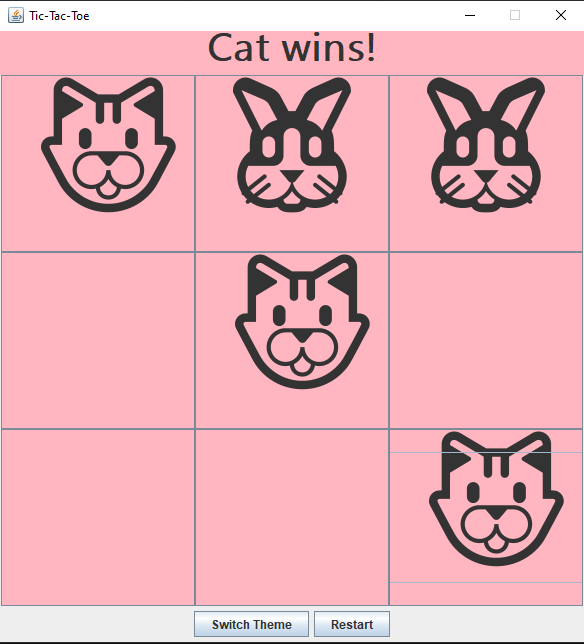
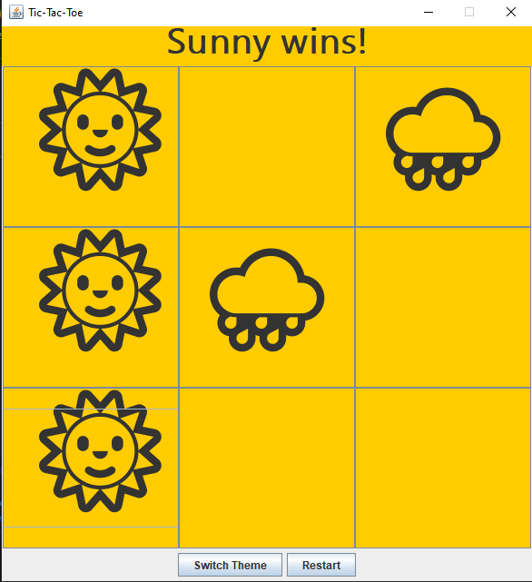

# Themed Tic-Tac-Toe

A **Java Swing Tic Tac Toe game** with fun **theme switching**!  
Play as **Cat 🐱 vs Bunny 🐰** or **Sunny 🌞 vs Rainy 🌧️**.  
This project uses **OOP principles** and cool **design patterns**.

---

##  Features

-   **Dynamic Theme Switching** — switch between Animal and Weather themes.  
-   **Clean Object-Oriented Design** with **design patterns** for structure and flexibility.  
- 🔁 **Restart Game** button to start fresh.  
-  **Clean GUI** with cute icons and colors.

---

## 📁 Project Structure

```
Themed-Tic-Tac-Toe/
├── App.java
├── GameManager.java
├── Player.java
├── TicTacToe.java
├── Theme.java
├── ThemeFactory.java
├── ThemeObserver.java
├── AnimalTheme.java
├── WeatherTheme.java
├── README.md
└── assets/
    ├── animal-theme.png
    └── weather-theme.png
```

---

##   Preview

### 🐱 Animal Theme


### 🌞 Weather Theme


---
## How to Run

Follow these steps to run Themed Tic-Tac-Toe:

1. **Open Terminal / Git Bash / Command Prompt** in the project folder `Themed-Tic-Tac-Toe`.

2. **Compile all Java files** by running:
      
       bash
       javac *.java
      

4. **Run the game with:**
 java App

5. The Tic-Tac-Toe window should open.

     - Click on Switch Theme to change between Animal 🐱/🐰 and Weather 🌞/🌧️ themes.
     - Click Restart to start a new game.

---
## Technologies Used

- **Java** – programming language for core logic  
- **Swing** – for building the graphical user interface (GUI)  
- **Object-Oriented Programming (OOP)** – classes, objects, encapsulation  
- **Design Patterns** – to make code modular, reusable, and maintainable  


